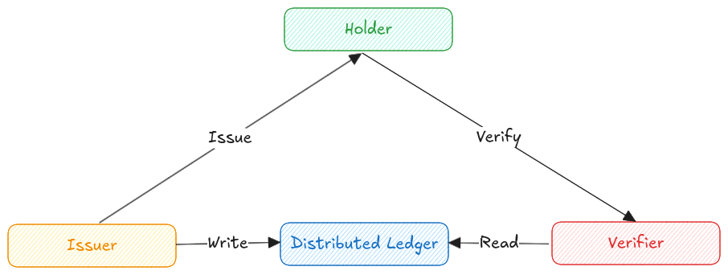

# Concepts

## **SSI (Self-Sovereign Identity)**

Self-Sovereign Identity (SSI) is a decentralized approach to digital identity, where individuals have complete control over their data. With SSI, users can create, manage, and share their identity information without relying on central authorities like governments or corporations. Key principles of SSI include:

* **Existence**: Users should be able to exist in the digital world without a third party.
* **Control**: Users should have complete authority over their identities and data.
* **Access**: Users should be able to easily access their own data.
* **Transparency**: The management and updates of identity systems and algorithms should be transparent and publicly available.
* **Persistence**: Identities should be long-lasting.
* **Portability**: Users should be able to move their identities and credentials anywhere, and transport their data between platforms.
* **Interoperability**: Identities should be usable across a range of services.
* **Consent**: Users should explicitly give permission for their data to be used or accessed.
* **Minimization**: Users should only share the minimum amount of data necessary.
* **Protection**: Users' right to privacy should be protected, and safeguards should be in place to prevent tampering and monitoring.

## Verifiable Credentials

Verifiable Credentials (VCs) are digital proofs that securely verify information about a person, organization, or object. Issued by trusted parties, they can be easily verified by others. Unlike traditional credentials, VCs are tamper-resistant, can be shared digitally, and protect the holder's privacy. They use cryptographic proofs to ensure the data’s integrity and authenticity.

## DIDs

A DID (Decentralized Identifier) is a unique identifier that doesn't rely on a central authority for registration. It is usually created and secured using cryptography. The standard format for a DID is outlined in the DID Syntax, and each DID system follows a specific method defined in a DID method specification. Many, though not all, DID methods use distributed ledger technology (DLT) or other decentralized networks.

## **Trust-triangle**

<figure><figcaption>
Trust-triangle diagram
</figcaption></figure>

### **Issuer**

Issuers create verifiable credentials and give them to holders. Whether a holder qualifies for a credential is based on the issuer's rules and procedures. Issuers are usually organizations like governments, universities, or banks, but individuals can also be issuers.

### Holder

A holder is an entity that receives a verifiable credential, allowing them to perform a specific role or task. While we often think of a holder as a person, it could also be an organization or object (like a registered car). Holders get credentials by requesting them from issuers.

### Verifier

A verifier is anyone who needs to check the proof of information from one or more credentials given to a holder. Verifiers decide their own rules based on the situation, including what proofs they need and which issuers they trust.

## Agent

An agent is a software tool that helps manage and exchange verifiable credentials in a secure and trustworthy way. It acts as an intermediary, handling communication between parties while following specific protocols to ensure the integrity of the credentials. It operates within key layers of the Trust Over IP framework to support various credential formats and processes. CREDEBL works with these agents :

[CREDO](https://credo.js.org/)\
[ACA-PY](https://github.com/openwallet-foundation/acapy) (Coming soon)

### Types

* **Shared Agent**: An agent that acts on behalf of multiple entities (nodes) to perform tasks within the network.
* **Dedicated Agent**: An agent that is deployed and managed exclusively for a single organization. It operates solely for one tenant and is typically deployed either on-premises or in a private cloud environment.

## Schema

A schema is a structured framework that defines the types of data and formats used in verifiable credentials. It specifies the attributes, properties, and relationships of the data, ensuring consistency and clarity across systems. By providing a common understanding of how identity information is organized and exchanged, schemas enhance interoperability, enabling effective communication among issuers, holders, and verifiers within the SSI ecosystem. CREDEBL supports [anoncreds](https://hyperledger.github.io/anoncreds-spec/#schema-publisher-publish-schema-object) and [`JOSN-LD`](https://www.w3.org/TR/vc-json-schema/) schemas.

### Credential-definition

A credential definition (CRED\_DEF or CLAIM\_DEF) contains the public data needed for issuing credentials and validating them. Multiple credentials can be issued from a single definition. Created by the issuer before any credential issuance, it is published for use by holders and verifiers. Alongside the public definition, the issuer generates private data, including the keys required to sign verifiable credentials. Optionally, a credential definition can be set up to allow the revocation of issued credentials.

## Wallet

wallet is a digital application that securely stores and manages a user's verifiable credentials and decentralized identifiers (DIDs). It allows individuals to control their data, facilitating the issuance, storage, and sharing of identity information without relying on central authorities. Wallets provide users with an interface to interact with various services, enabling them to present their credentials selectively while maintaining privacy and security.

### Edge Wallet

An edge wallet is a digital wallet that functions directly on a user's device, allowing individuals to store, manage, and control their verifiable credentials and decentralized identifiers (DIDs) locally. This decentralized approach enhances privacy and security by keeping sensitive identity data close to the user and reducing reliance on cloud storage or third-party services. Edge wallets facilitate seamless interactions with various services, enabling users to selectively share their credentials while retaining full control over their personal information. Check the [ADEYA](https://github.com/credebl/adeya-wallet) wallet.

### Cloud Wallet

A cloud wallet is a digital wallet that stores and manages a user's verifiable credentials and decentralized identifiers (DIDs) in the cloud, enabling access from any internet-connected device. While offering convenience and ease of use, cloud wallets require trust in the service provider to protect sensitive data. Users can easily interact with various services and share their credentials.

## Mediator

A mediator is an intermediary service that facilitates communication and data exchange between parties in the identity verification process. It manages the flow of verifiable credentials and decentralized identifiers (DIDs) among issuers, holders, and verifiers, enhancing usability and interoperability across systems. By enabling secure sharing of identity information, mediators help users maintain privacy and control over their data while ensuring that presented credentials are valid and trustworthy.

<figure><figcaption></figcaption></figure>

\
