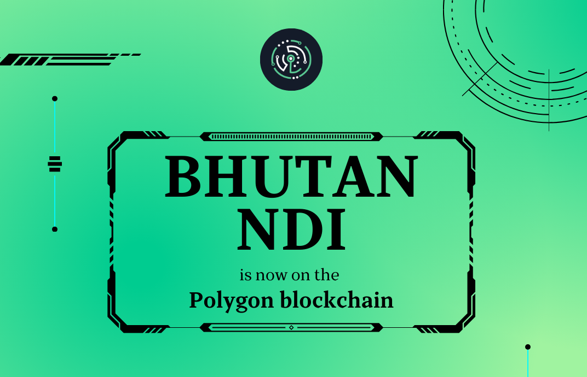
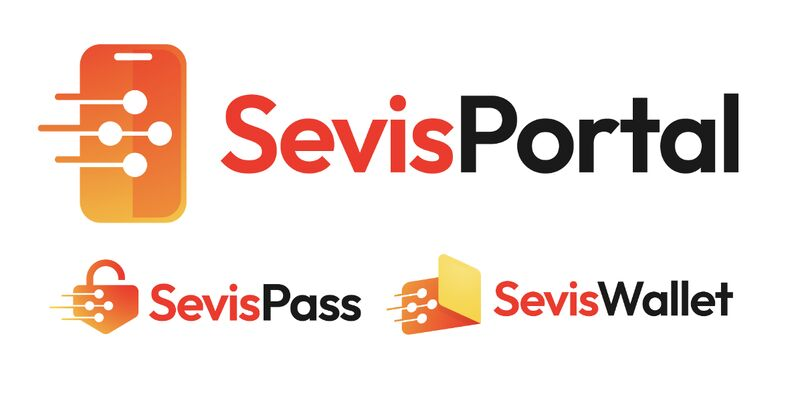

# 🚀 Implementations

### [**National Digital Identity**](https://www.bhutanndi.com/) **for Royal Government of Bhutan**

<figure><figcaption>
Bhutan NDI migration to CREDEBL &#x26; Polygon Blockchain
</figcaption></figure>



### **SevisPass Digital ID Pilot for Papua New Guinea**

<figure><figcaption>
SevisPass &#x26; SevisWallet Digital ID Pilot
</figcaption></figure>



### CREDEBL SaaS

[CREDEBL Platform](https://credebl.id) is hosted & made available by AYANWORKS as a SaaS offering for various Digital Credential Solutions&#x20;

* **EduCreds** (Academic Credentials)
* **Sports Awards**

